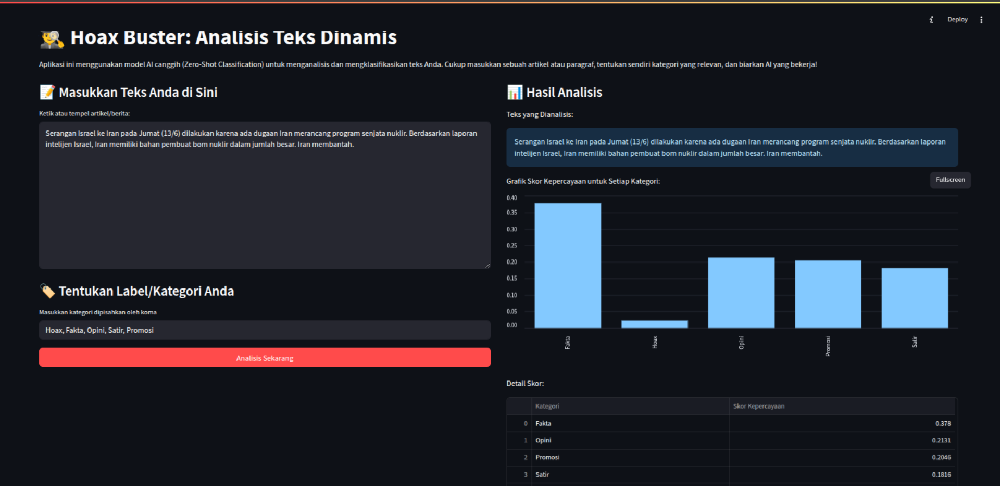

# 🕵️‍♂️ Hoax Buster AI

[](https://www.python.org/)
[](https://streamlit.io)
[](https://huggingface.co/models)
[](https://opensource.org/licenses/MIT)

Aplikasi web cerdas yang dibangun dengan Streamlit dan ditenagai oleh model AI dari Hugging Face untuk menganalisis dan mengklasifikasikan teks secara dinamis. Bantu perangi misinformasi dengan mengidentifikasi potensi hoaks, opini, atau fakta dari sebuah artikel berita.



---

## ✨ Tentang Proyek Ini

Di era informasi yang serba cepat, membedakan antara fakta, opini, dan hoaks menjadi sebuah tantangan. **Hoax Buster AI** hadir sebagai alat bantu untuk menganalisis teks secara kritis. Berbeda dari aplikasi klasifikasi biasa yang kaku, aplikasi ini menggunakan keajaiban _Zero-Shot Classification_, yang memungkinkan Anda sebagai pengguna untuk menentukan sendiri label atau kategori analisis secara _real-time_.

### Fitur Utama:

- **Klasifikasi Dinamis**: Tentukan sendiri kategori yang relevan (misal: `Hoax`, `Fakta`, `Opini`, `Promosi`) tanpa perlu melatih ulang model.
- **Antarmuka Intuitif**: Didesain dengan Streamlit agar mudah digunakan oleh siapa saja, tanpa perlu latar belakang teknis.
- **Hasil Visual**: Dapatkan hasil analisis dalam bentuk grafik batang yang jelas dan mudah dipahami.
- **Didukung Model Canggih**: Menggunakan model Transformer `facebook/bart-large-mnli` dari Hugging Face yang telah terbukti andal untuk tugas _Zero-Shot Classification_.

---

## 🛠️ Teknologi yang Digunakan

Proyek ini dibangun menggunakan teknologi-teknologi modern berikut:

<p align="left">
  <a href="https://www.python.org" target="_blank" rel="noreferrer">
    
  </a>
  <a href="https://streamlit.io" target="_blank" rel="noreferrer">
    
  </a>
  <a href="https://huggingface.co/" target="_blank" rel="noreferrer">
    
  </a>
  <a href="https://pandas.pydata.org/" target="_blank" rel="noreferrer">
    
  </a>
</p>

---

## 🚀 Instalasi & Menjalankan Secara Lokal

Ikuti langkah-langkah berikut untuk menjalankan aplikasi ini di komputer Anda.

### Prasyarat

- Python 3.9 atau lebih baru
- Git

### Langkah-langkah

1.  **Clone repository ini:**

    ```bash
    git clone https://github.com/AmirulMirdas2/Hoax-Buster-Analisis-Teks-Dinamis.git
    cd Hoax-Buster-Analisis-Teks-Dinamis
    ```

2.  **Buat dan aktifkan virtual environment (sangat direkomendasikan):**

    ```bash
    # Untuk MacOS/Linux
    python3 -m venv venv
    source venv/bin/activate

    # Untuk Windows
    python -m venv venv
    .\venv\Scripts\activate
    ```

3.  **Install semua library yang dibutuhkan:**

    ```bash
    pip install -r requirements.txt
    ```

4.  **Jalankan aplikasi Streamlit:**
    ```bash
    streamlit run app.py
    ```
    Aplikasi akan otomatis terbuka di browser Anda!

---

## 📖 Cara Menggunakan Aplikasi

1.  **Masukkan Teks**: Ketik atau salin-tempel artikel berita atau paragraf yang ingin Anda analisis ke dalam kotak teks utama.
2.  **Tentukan Label**: Di kotak kedua, masukkan kategori-kategori yang ingin Anda gunakan untuk analisis. Pisahkan setiap kategori dengan koma. Contoh: `Fakta, Hoax, Opini, Satir`.
3.  **Klik Analisis**: Tekan tombol "Analisis Sekarang".
4.  **Lihat Hasil**: Tunggu beberapa saat hingga AI selesai menganalisis. Hasilnya akan ditampilkan dalam bentuk grafik dan tabel di sisi kanan, menunjukkan skor kepercayaan untuk setiap kategori yang Anda tentukan.

---

## 🧠 Cara Kerja (Keajaiban di Balik Layar)

Aplikasi ini menggunakan model **Zero-Shot Classification**. Anggap saja model ini seperti seorang manajer super cerdas. Anda tidak perlu melatihnya secara spesifik. Anda cukup memberinya sebuah dokumen (teks berita) dan beberapa nama folder (label/kategori). Berdasarkan pemahamannya yang luas tentang bahasa, ia dapat secara akurat menentukan dokumen tersebut paling cocok masuk ke folder mana, meskipun ia belum pernah melihat kombinasi dokumen dan folder tersebut sebelumnya.

---

## 🗺️ Rencana Pengembangan (Roadmap)

Proyek ini masih bisa dikembangkan lebih lanjut. Beberapa ide untuk masa depan:

- [ ] **Analisis dari URL**: Fitur untuk menempelkan link berita dan aplikasi akan otomatis mengambil teksnya.
- [ ] **Set Label Siap Pakai**: Menambahkan pilihan dropdown untuk set label umum (Analisis Sentimen, Analisis Emosi, dll).
- [ ] **Sejarah Analisis**: Menyimpan beberapa analisis terakhir menggunakan `st.session_state`.
- [ ] **Deployment**: Menerapkan aplikasi ini ke Streamlit Community Cloud agar bisa diakses siapa saja secara online.

---

## 📜 Lisensi

Proyek ini dilisensikan di bawah **MIT License**. Lihat file `LICENSE` untuk detail lebih lanjut.

---

<p align="center">
  Dibuat dengan ❤️ untuk melawan misinformasi.
</p>
